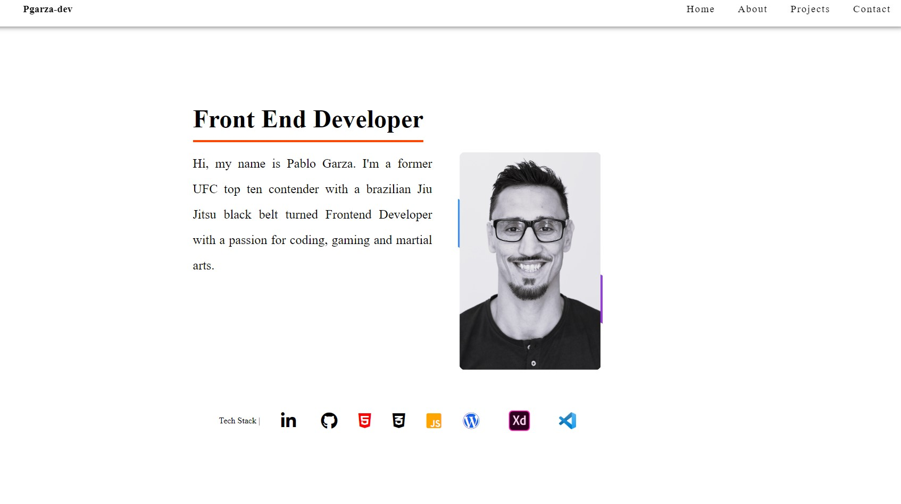

# Proffesional-Portfolio

This is a Portfolio I built to showcase my work during my first year at Noroff. The purpose
of this project was to display all my projects I have made over the course of my first year
at Noroff.




### Discription

Upon entering the Portfolio site you will see an photo of myself along with a
short background discription text about myself followd by two clickable GitHub and a Linked-In
icons to allow for quick and easy access to more information about my work and experience.
My Tech Stack is displayed with icons to signify what I have worked with for these projects.

From the top of the page you can navigate to each of the protfolio sections.

- Home
- About
- Projects
- Contact

Each of my projects is presented as cards with a image of the projectes landing page, a title,
a short project description, the tech stack used for the project and two clickable icons
that will take you directly to the project website and the code in my GitHub.


In the footer section are located icon links to all my personal contacts. 


## Built With

My projects have been built with a combination of

- JavaScript
- CSS
- Word Press for makeing API calls
- Adobe XD for project designs
- Bluehost.com for my project domain


## Getting Started

### Installing

1. Clone the repo:

```bash
git clone https://github.com/Pgarza-dev/Proffesional-Portfolio.git
```

2. Install the dependencies:

```
npm install
```
Instale Live Server


### Running

To run the site, run the following commands:

```bash
npm run start
```
[liveServer] - instaling live server will allow you to run the site localy on your own machine

[Netlify] - this link will take you directly to the live site
          - https://melodious-frangollo-6c58fd.netlify.app/


## Contact

This is where you can leave your social links for people to contact you, such as a LinkedIn profile or Twitter link e.g.

[My Twitter page](https://twitter.com/PabloGarzaMMA)

[My LinkedIn page](https://www.linkedin.com/in/pablo-garza-4a897762/)

[Email](p.garza1983@gmail.com) 


## Contributing

Please make sure to open a pull request so code can be reviewed.
----------------------------------------------------------------------


